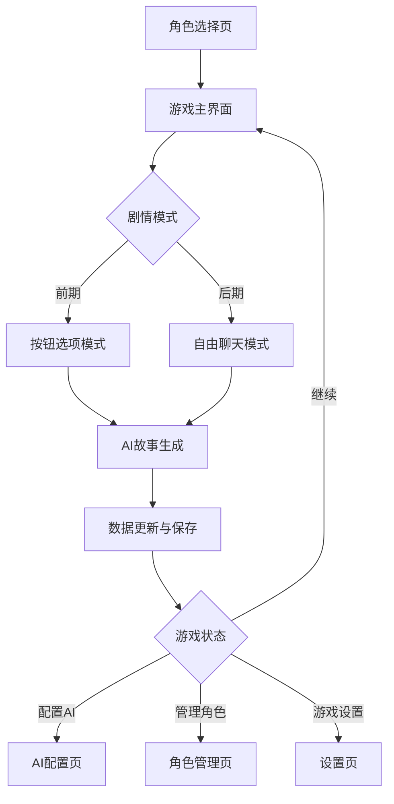

## 1. 产品概述
《时光电台·雨迹》是一款AI驱动的文字冒险游戏，玩家通过AI续写的故事进行沉浸式剧情体验。游戏采用现代都市双男主情感剧设定，结合时间穿越元素，玩家可以从固定按钮推进剧情切换到自由对话模式，与AI扮演的NPC进行深度互动。

产品核心价值：通过AI技术创造个性化的叙事体验，让玩家在现代都市背景中体验时间、记忆与情感的交织故事。

## 2. 核心功能

### 2.1 用户角色
| 角色 | 注册方式 | 核心权限 |
|------|----------|----------|
| 玩家 | 无需注册，直接进入游戏 | 体验完整游戏剧情、自定义AI配置、角色图片上传、本地存档 |

### 2.2 功能模块
游戏包含以下核心页面：
1. **角色选择页**：两个初始角色卡选择，双线剧情推进
2. **游戏主界面**：故事展示、选项按钮、自由聊天切换、设置入口
3. **AI配置页**：AI服务选择、API密钥配置、模型参数调整
4. **角色管理页**：人物图片上传、角色信息查看、记忆管理
5. **设置页**：游戏设置、存档管理、关于信息

### 2.3 页面详情
| 页面名称 | 模块名称 | 功能描述 |
|----------|----------|----------|
| 角色选择页 | 角色卡片展示 | 显示两个可选择的角色卡（陈诺线/林哲线），包含角色背景、性格特点 |
| 角色选择页 | 选择确认 | 玩家选择角色后进入对应剧情线 |
| 游戏主界面 | 故事展示区 | 显示AI生成的故事内容，支持滚动查看历史记录 |
| 游戏主界面 | 选项按钮区 | 前期显示5个固定选项按钮，后期可切换至自由输入 |
| 游戏主界面 | 聊天输入区 | 自由输入模式下显示文本输入框和发送按钮 |
| 游戏主界面 | 模式切换 | 按钮模式与自由聊天模式之间的切换 |
| 游戏主界面 | 自动保存指示 | 显示上次保存时间和保存状态 |
| AI配置页 | 服务商选择 | 支持OpenAI、Claude、本地部署等多种AI服务 |
| AI配置页 | API密钥输入 | 安全输入和存储用户的API密钥 |
| AI配置页 | 模型参数 | 调整温度、最大token数等生成参数 |
| 角色管理页 | 图片上传 | 支持角色头像和场景图片上传，本地存储 |
| 角色管理页 | 角色信息 | 查看和编辑角色基本信息 |
| 角色管理页 | 记忆查看 | 查看AI记忆的历史对话和事件 |
| 设置页 | 游戏设置 | 音效、字体大小、主题等个性化设置 |
| 设置页 | 存档管理 | 手动保存、加载、删除游戏进度 |
| 设置页 | 关于信息 | 游戏版本、开发团队、使用说明 |

## 3. 核心流程

### 玩家游戏流程
1. **角色选择**：玩家选择陈诺线或林哲线开始游戏
2. **剧情推进**：前期通过点击固定选项按钮推进故事
3. **模式切换**：剧情完成后可切换至自由对话模式
4. **AI交互**：自由输入与AI扮演的NPC进行深度对话
5. **记忆累积**：AI自动记录对话历史，后续回答会参考历史记忆

### 系统处理流程
1. **故事生成**：根据玩家选择和历史记忆，AI生成新的故事内容
2. **数据同步**：更新游戏状态、角色信息、记忆数据
3. **本地存储**：自动保存游戏进度到浏览器本地存储
4. **界面更新**：实时显示新的故事内容和可用选项

## 4. 用户界面设计

### 4.1 设计风格
- **设计风格**：新粗野主义（Neo-Brutalism）
- **主色调**：#9C5DAB（紫罗兰）、#423D54（深灰紫）、#E5E4E9（浅灰）
- **按钮样式**：厚重立体边框，明显的阴影效果
- **字体选择**：无衬线字体，标题使用粗体，正文字号16px
- **布局风格**：卡片式布局，强烈的几何对比
- **图标风格**：简洁线条图标，保持厚重感

### 4.2 页面设计概述
| 页面名称 | 模块名称 | UI元素 |
|----------|----------|----------|
| 角色选择页 | 角色卡片 | 大尺寸卡片，厚重边框，角色头像圆形显示，背景渐变效果 |
| 游戏主界面 | 故事展示区 | 全屏背景，半透明卡片承载故事内容，优雅的文字排版 |
| 游戏主界面 | 选项按钮 | 厚重立体按钮，悬停有阴影变化，点击有明显反馈 |
| 游戏主界面 | 聊天输入 | 底部固定输入栏，圆角边框，发送按钮突出显示 |
| AI配置页 | 配置表单 | 分组卡片布局，输入框厚重边框，配置项清晰分组 |
| 角色管理页 | 图片上传 | 拖拽上传区域，预览图显示，支持多图片管理 |

### 4.3 响应式设计
- **桌面优先**：基于1440px宽度设计，向下适配
- **移动端适配**：断点设置在768px，采用垂直布局
- **触摸优化**：按钮最小44px高度，增加触摸反馈
- **字体适配**：根据屏幕尺寸调整字体大小
- **图片适配**：响应式图片，支持Retina显示