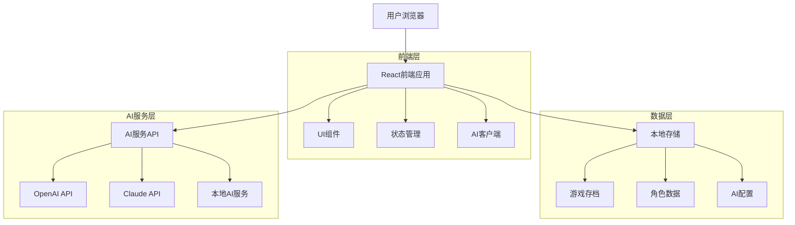
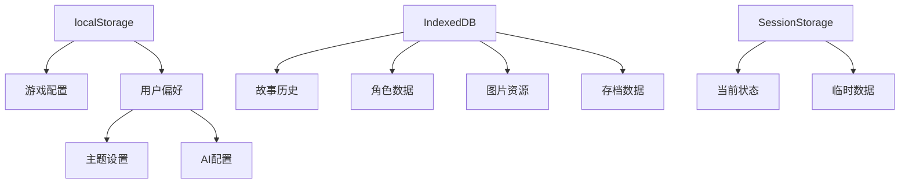

## 1. 架构设计



## 2. 技术描述

- **前端框架**: React@18 + TypeScript + Vite
- **样式方案**: TailwindCSS@3 + 自定义新粗野主义主题
- **状态管理**: Zustand（轻量级状态管理）
- **UI组件**: HeadlessUI + 自定义组件库
- **本地存储**: localStorage + IndexedDB（大容量数据）
- **AI集成**: OpenAI API SDK + Anthropic SDK
- **图片处理**: Canvas API + File API
- **构建工具**: Vite@5
- **包管理**: pnpm

## 3. 路由定义

| 路由 | 用途 |
|------|------|
| `/` | 角色选择页，选择游戏角色 |
| `/game` | 游戏主界面，核心游戏体验 |
| `/ai-config` | AI服务配置页面 |
| `/character` | 角色管理和图片上传 |
| `/settings` | 游戏设置和存档管理 |

## 4. 核心数据类型定义

### 4.1 游戏状态类型
```typescript
interface GameState {
  currentCharacter: Character;
  gameProgress: GameProgress;
  storyHistory: StorySegment[];
  aiMemory: AIMemory;
  settings: GameSettings;
}

interface Character {
  id: string;
  name: string;
  role: 'chennuo' | 'linzhe';
  avatar?: string;
  background: string;
  personality: string[];
}

interface StorySegment {
  id: string;
  timestamp: number;
  content: string;
  playerChoice?: string;
  aiResponse?: AIResponse;
  mode: 'button' | 'chat';
}

interface AIResponse {
  text: string;
  midTermMemory: string;
  tavernCommands: TavernCommand[];
  actionOptions?: string[];
}

interface TavernCommand {
  action: 'set' | 'add' | 'push' | 'delete';
  key: string;
  value: any;
}
```

### 4.2 AI配置类型
```typescript
interface AIConfig {
  provider: 'openai' | 'claude' | 'local';
  apiKey: string;
  model: string;
  temperature: number;
  maxTokens: number;
  systemPrompt: string;
}

interface AIRequest {
  messages: Message[];
  memory: AIMemory;
  character: Character;
  gameState: GameStateSnapshot;
}

interface Message {
  role: 'user' | 'assistant' | 'system';
  content: string;
}
```

## 5. 本地存储架构



## 6. AI集成架构

### 6.1 AI服务管理器
```typescript
class AIServiceManager {
  private providers: Map<string, AIProvider>;
  
  async generateResponse(request: AIRequest): Promise<AIResponse> {
    const provider = this.getActiveProvider();
    return await provider.generate(request);
  }
  
  async validateConfig(config: AIConfig): Promise<boolean> {
    // 验证API密钥和连接性
  }
}

interface AIProvider {
  generate(request: AIRequest): Promise<AIResponse>;
  validateApiKey(key: string): Promise<boolean>;
  getAvailableModels(): string[];
}
```

### 6.2 记忆管理系统
```typescript
class MemoryManager {
  private memory: AIMemory;
  
  addInteraction(interaction: Interaction): void {
    this.memory.interactions.push(interaction);
    this.trimMemory();
  }
  
  getContext(): string {
    // 构建AI上下文，包含相关历史
    return this.buildContext();
  }
  
  private trimMemory(): void {
    // 保持内存大小在合理范围内
    if (this.memory.interactions.length > 100) {
      this.memory.interactions = this.memory.interactions.slice(-80);
    }
  }
}
```

## 7. 响应式布局系统

### 7.1 断点设计
```css
/* 新粗野主义主题变量 */
:root {
  --color-primary: #9C5DAB;
  --color-secondary: #423D54;
  --color-background: #E5E4E9;
  --border-heavy: 4px solid var(--color-secondary);
  --shadow-brutal: 8px 8px 0px var(--color-secondary);
}

/* 响应式断点 */
@media (min-width: 1024px) { /* 桌面端 */
  .container { max-width: 1200px; }
  .story-text { font-size: 18px; line-height: 1.8; }
}

@media (max-width: 768px) { /* 移动端 */
  .container { padding: 16px; }
  .story-text { font-size: 16px; line-height: 1.6; }
  .button-brutal { min-height: 44px; font-size: 16px; }
}
```

### 7.2 组件架构
```typescript
// 新粗野主义按钮组件
const BrutalButton: React.FC<BrutalButtonProps> = ({ 
  children, 
  variant = 'primary',
  size = 'medium',
  onClick 
}) => {
  return (
    <button
      className={`
        brutal-button brutal-${variant} brutal-${size}
        border-4 border-secondary shadow-brutal
        hover:shadow-brutal-hover active:shadow-brutal-active
        transition-all duration-150
      `}
      onClick={onClick}
    >
      {children}
    </button>
  );
};
```

## 8. 部署配置

### 8.1 环境变量
```env
# AI服务配置
VITE_OPENAI_API_KEY=your_openai_key
VITE_CLAUDE_API_KEY=your_claude_key
VITE_AI_PROVIDER=openai

# 应用配置
VITE_APP_NAME=时光电台·雨迹
VITE_APP_VERSION=1.0.0
VITE_ENABLE_ANALYTICS=true
```

### 8.2 构建优化
```typescript
// vite.config.ts
export default defineConfig({
  build: {
    rollupOptions: {
      output: {
        manualChunks: {
          'ai-sdk': ['openai', '@anthropic-ai/sdk'],
          'ui-lib': ['@headlessui/react', 'lucide-react'],
          'utils': ['date-fns', 'lodash-es']
        }
      }
    }
  },
  optimizeDeps: {
    include: ['openai', '@anthropic-ai/sdk']
  }
});
```